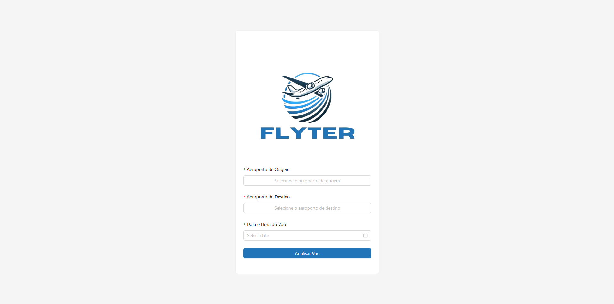
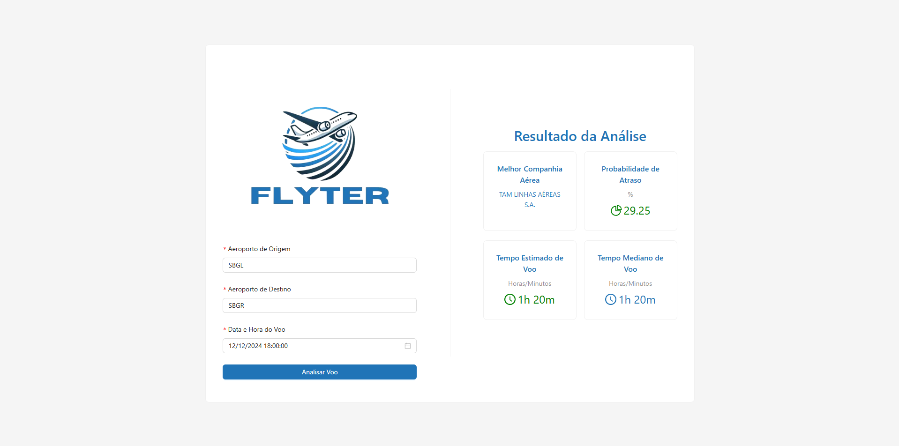

# ✈️🌐 Flight Analyzer Frontend 

## Motivação do Projeto
O **Flight Analyzer Frontend** é a interface de usuário desenvolvida para facilitar a análise de voos com base em dados meteorológicos e operacionais. Esta aplicação permite ao usuário inserir dados como o aeroporto de origem, destino e data do voo, e visualizar resultados detalhados, como probabilidade de atraso, tempo estimado de voo e a melhor companhia aérea recomendada. A ideia principal é fornecer uma experiência visual intuitiva e responsiva, utilizando os dados analisados pelo backend.

---

## Arquitetura do Projeto 🏗️

O frontend foi desenvolvido com **React.js** e utiliza componentes da biblioteca **Ant Design** para construção de uma interface visualmente agradável e responsiva. A estrutura de pastas segue os padrões modernos de organização em projetos React, separando responsabilidades por componentes, serviços e arquivos públicos.

**Estrutura de Pastas:**
```
flight-analyzer-frontend/
│
├── node_modules/             # Dependências do projeto gerenciadas pelo npm
├── public/                   # Arquivos públicos como favicon, imagens e index.html
│   ├── images/               # Diretório para armazenar imagens estáticas
│   │   ├── favicon.ico       # Ícone da aplicação
│   │   ├── logo192.png       # Logotipo da aplicação em resolução menor
│   │   ├── logo512.png       # Logotipo da aplicação em resolução maior
│   ├── index.html            # HTML base da aplicação
│   ├── manifest.json         # Configurações do manifest da aplicação
│   └── robots.txt            # Configuração de bots de busca
│
├── src/                      # Código-fonte principal da aplicação
│   ├── components/           # Componentes React reutilizáveis
│   │   └── FlightAnalyzer/   # Componente principal para a interface de análise
│   │       ├── FlightAnalyzer.js  # Arquivo JSX do componente principal
│   │       └── FlightAnalyzer.css # Arquivo CSS do componente principal
│   ├── services/             # Serviços para comunicação com o backend
│   │   └── FlightAnalyzerService.js # Arquivo responsável por chamadas API
│   ├── App.js                # Componente principal da aplicação
│   ├── App.css               # Estilos globais da aplicação
│   ├── App.test.js           # Testes para o componente App
│   ├── index.js              # Ponto de entrada da aplicação React
│   ├── index.css             # Estilos globais adicionais
│   ├── logo.svg              # Logotipo SVG usado na aplicação
│   ├── reportWebVitals.js    # Relatório de métricas de desempenho
│   └── setupTests.js         # Configuração para testes
│
├── .env                      # Configurações de variáveis de ambiente
├── .gitignore                # Arquivos e pastas ignorados pelo Git
├── package.json              # Informações do projeto e dependências
├── package-lock.json         # Versões exatas das dependências instaladas
└── README.md                 # Documentação do projeto
```

---

## 💡 Funcionalidades Principais

1. **Formulário de Entrada de Dados**
   - Inputs para selecionar aeroportos de origem e destino.
   - Seleção de data e hora do voo.
   - Validação automática dos campos.

2. **Exibição de Resultados**
   - Probabilidade de atraso (%).
   - Tempo estimado de voo (h:m).
   - Melhor companhia aérea recomendada.

3. **Design Responsivo**
   - Interface adaptável a diferentes tamanhos de tela, garantindo usabilidade em dispositivos móveis e desktops.

---

## ✅ Requisitos do Projeto

- **Node.js** (v14 ou superior)
- **npm** ou **yarn**
- Arquivo `.env` configurado com a URL do backend.

---

## 🔧 Ferramentas e Dependências

- **React.js**: Framework principal da aplicação.
- **Ant Design**: Biblioteca de componentes visuais.
- **Axios**: Para realizar requisições HTTP ao backend.
- **dotenv**: Gerenciamento de variáveis de ambiente.
- **React Testing Library**: Ferramenta para testes unitários e de integração.

---

## 🌐 Configuração do Ambiente

1. Clone o repositório:
   ```bash
   git clone https://github.com/seu-usuario/flight-analyzer-frontend.git
   ```

2. Acesse o diretório do projeto:
   ```bash
   cd flight-analyzer-frontend
   ```

3. Instale as dependências:
   ```bash
   npm install
   ```

4. Configure o arquivo `.env`:
   Crie um arquivo `.env` na raiz do projeto e adicione a seguinte variável:
   ```env
   REACT_APP_BACKEND_URL=http://localhost:3001
   ```

5. Inicie o servidor de desenvolvimento:
   ```bash
   npm start
   ```

---

## 🖼️ Imagens da Aplicação

### Tela Inicial:


### Tela com Resultados:

